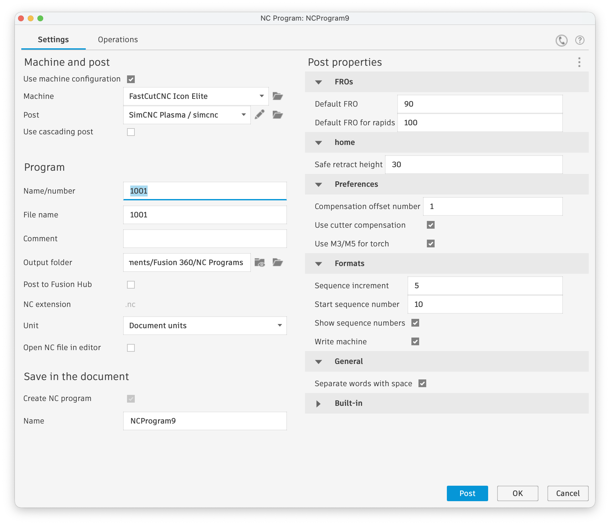
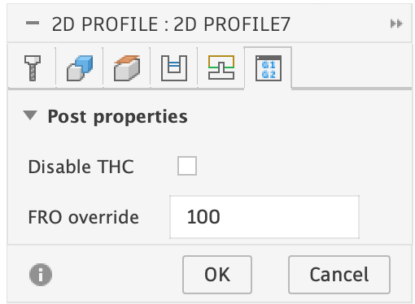

# FastCutCNC

Scripts related to my FastCutCNC &lt;> SimCNC conversion

## Fusion360

A basic post-processor for Fusion 360, that works well with my FastCutCNC Icon Elite table.

Notable features: 
- supports G41/ G42 for cut path compensation via SimCNC. Requires SimCNC 3.5 or later.
- Supports disabling THC for cut paths, so eg circles can be cut without it
- Supports slowing down via FRO, so eg circles can be cut at 60% speed, via custom M220 macro
- Supports both imperial and metric documents, via G20/ G21.

Note that Fusion 360 pierce height, cut height and kerf settings are ignored as these need to be configured in SimCNC.

## SimCNC

Scripts contain a number of useful-to-me python scripts I use in SimCNC very frequently.